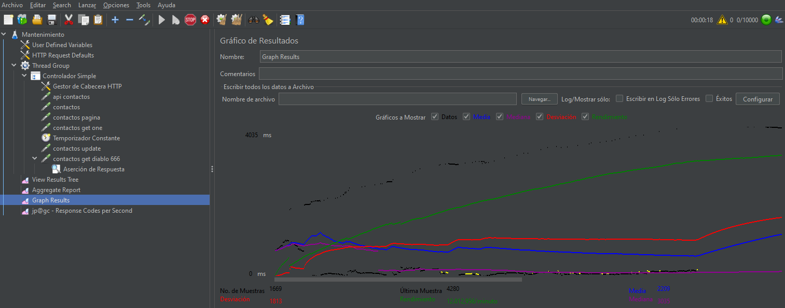

# QA Trabajos de Roman Mysyura

## Este es el repositorio con los trabajos que he hecho durante la formación en Logirail.

Las carpetas:

📁[Los tests con JMeter de GildedRose](https://github.com/RomanMysyura/GildedRoseQA-JUnit/tree/master/GildedRoseTestROMAN)  
📁[Pruebas con JMeter](https://github.com/RomanMysyura/GildedRoseQA-JUnit/tree/master/Apache%20JMETER)  
📁[Pruebas con SoapUI](https://github.com/RomanMysyura/GildedRoseQA-JUnit/tree/master/Proyectos%20SoapUI)  
📁[Pruebas HTTP con extension REST en VisualStudio](https://github.com/RomanMysyura/GildedRoseQA-JUnit/tree/master/Pruebas%20HTTP%20con%20REST)  
📁[Pruebas E2E con SeleniumIDE](https://github.com/RomanMysyura/GildedRoseQA-JUnit/tree/master/Selenium%20IDE)  
📁[Proyecto de Control de asistencia con el grupo](https://github.com/RomanMysyura/GildedRoseQA-JUnit/tree/master/TestLink)  

### Hemos hecho un proyecto en TestLink sobre una aplicación de control de asistencia de empleados. Yo me he encargado de hacer la parte de requisitos, casos de uso y casos de prueba del "Subsistema de encargado"

Primero de todo, he hecho el dibujo con un monigote del encargado y sus requisitos.

Luego los he puesto en TestLink

Después, he hecho las pruebas de aceptación.

Luego de hacer esto, he ejecutado las pruebas de rendimiento, y después de enviar, se ha guardado el estado en MantisDB

La parte más divertida fue hacer las pruebas E2E con Selenium IDE. Aquí tienes el proyecto que he hecho probando la página web para testing:

[Ver archivo](https://github.com/RomanMysyura/GildedRoseQA-JUnit/blob/master/Selenium%20IDE/Pruebas%20E2E.side)

Durante esta formación he aprendido muchas cosas interesantes, como trabajar con SoapUI, Postman, JMeter, ejecutar los tests JUnit con Maven y ver los resultados en SonarQube. La parte más interesante para mí fue Jenkins, que puede analizar el repositorio GitHub, y cuando detecta que el repositorio se ha actualizado, ejecuta los tests.

También me gustó hacer las pruebas con JMeter, porque con esta herramienta se puede comprobar cuántos usuarios puede aguantar una aplicación al mismo tiempo. En esta [carpeta](https://github.com/RomanMysyura/GildedRoseQA-JUnit/tree/master/Apache%20JMETER) puedes ver los proyectos que he hecho con JMeter.

